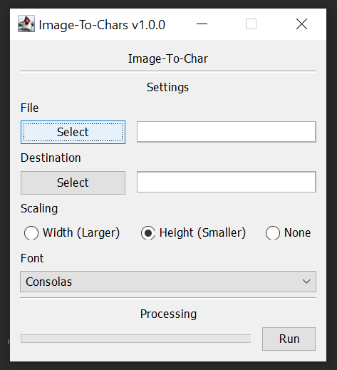
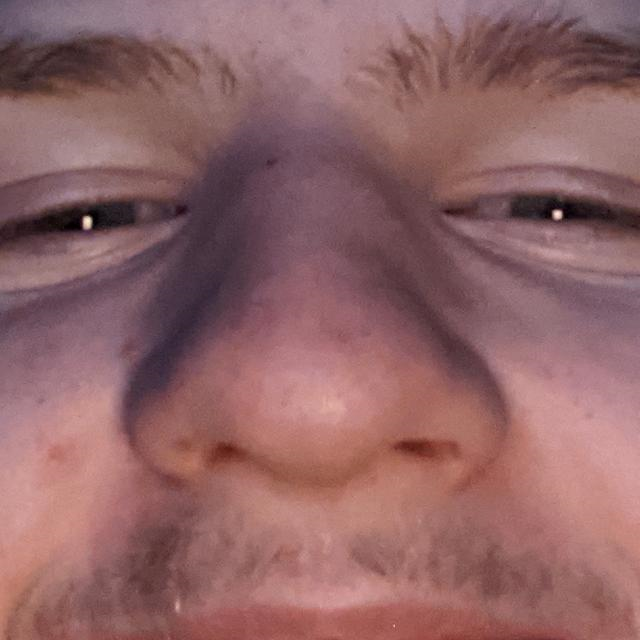
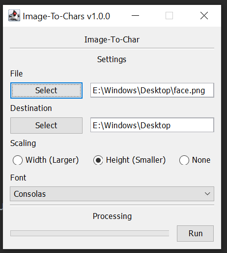
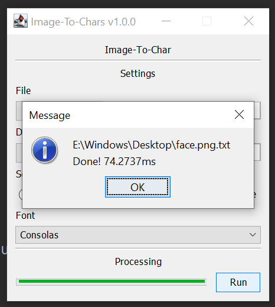
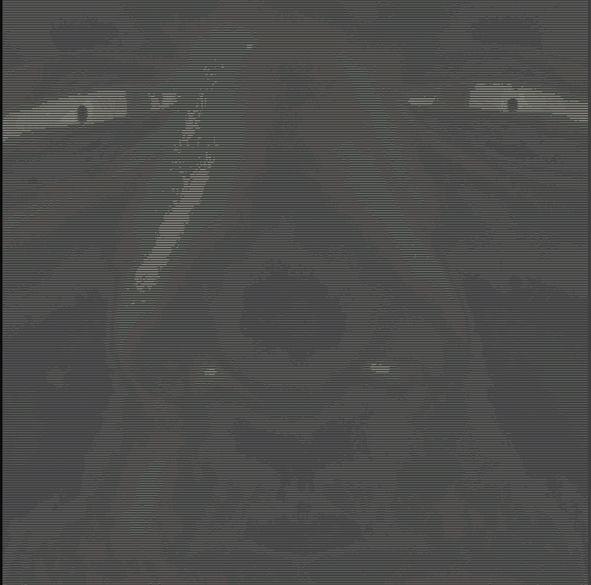

# Image-To-Chars
This little project is designed to convert an image into a sequence of ASCII characters to look like the selected image.

# Screenshots
This is how my small program looks
 

I want to convert this image of my face :)
 

It is now selected
 

After I ran the program it took a short time and then saved at the given path
 

This is the result
 

